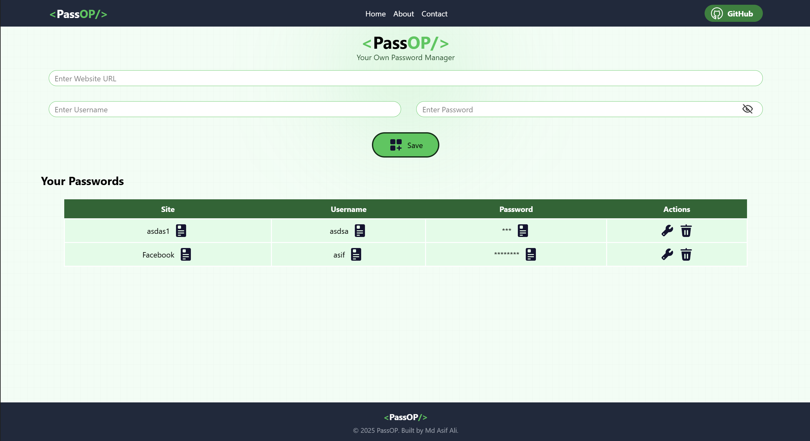

<p align="center">
  <h1>🔐 <PassOP/> </h1>
  <h3>Your Own Password Manager</h3>
</p>

<p align="center">
  <b>PassOP</b> is a secure and user-friendly password manager web app that lets you 
  <b>store, edit, and delete your passwords</b> safely.<br/>
  Built with <b>Express.js</b>, <b>Vite</b>, <b>React</b>, and <b>MongoDB Atlas</b>.
</p>

<p align="center">
  👉 <a href="https://pass-op-chi-one.vercel.app/"><b>Live Demo</b></a>  
</p>

---

<p align="center">
  
</p>

---

## ✨ Features  
- 🔒 Store website credentials (site, username, password) securely  
- ✏️ Edit and update saved passwords anytime  
- 🗑️ Delete credentials with one click  
- 👁️ Toggle hide/show for passwords  
- ⚡ Built with modern stack: React + Vite + Express.js  
- ☁️ Cloud-based storage with MongoDB Atlas  
- 🎨 Clean UI with smooth animations  

---

## 🛠️ Tech Stack  
<p align="center">

| Frontend | Backend | Database | Deployment |
|----------|---------|----------|-------------|
| React + Vite + TailwindCSS | Express.js + Node.js | MongoDB Atlas | Vercel (Frontend), Render/Other (Backend) |

</p>

👉 Backend Repo: [Pass-OP-Backend](https://pass-op-backend-jet.vercel.app/)  

---

## 🚀 Getting Started  

### Prerequisites  
- Node.js & npm installed  
- MongoDB Atlas account  

### Clone the repository  
```bash
git clone https://github.com/your-username/Pass-OP-Frontend.git
cd Pass-OP-Frontend
Install dependencies
bash
Copy code
npm install
Run locally
bash
Copy code
npm run dev
The app will start on http://localhost:5173/ 🎉

📂 Backend Repository
👉 Pass-OP-Backend

📸 Preview
<p align="center">  </p>
👨‍💻 Author
<p align="center"> Built with ❤️ by <b>Md Asif Ali</b> </p> ```
